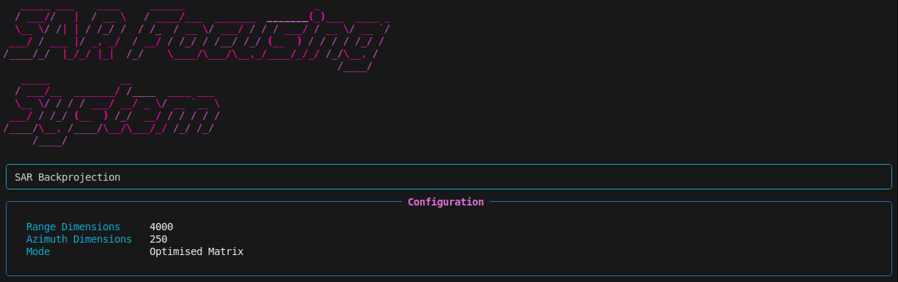

# SAR Focuser



## Description

SAR Focuser is an optimised implementation of the Back-Projection (BP) algorithm for Synthetic Aperture Radar (SAR) data processing. This software enables the processing of raw radar data to generate high-resolution focused SAR images. The implementation is optimised for high performance using just-in-time (JIT) compilation via Numba and parallelisation.

The primary focus is on matrix-based SAR focusing, which allows for the processing of large datasets with reasonable execution times, thanks to efficient memory management and automatic checkpointing for recovery of interrupted processing.

## Key Features

- Matrix-based implementation of the Back-Projection algorithm for SAR focusing
- Parallel processing via Numba JIT
- Checkpoint system to recover long processing runs in case of interruption
- Support for large SAR datasets
- Detailed reporting on execution times and statistics

## System Requirements

### Recommended Hardware
- **CPU**: Multi-core, at least 4 cores (8+ recommended for large datasets)
- **RAM**: Minimum 16GB, 32GB+ recommended for complete datasets
  - A dataset of dimensions 4762x40001 (as in the example) requires ~1.5GB for raw data alone
  - During processing, memory consumption can reach 3-4 times the size of the raw data
- **Storage**: SSD recommended for faster I/O operations, at least 10GB of free space

### Software
- Python 3.8 or higher
- Required Python packages (see `requirements.txt`)

## Installation

1. Clone the repository:
   ```bash
   git clone https://github.com/yourusername/sar-focuser.git
   cd sar-focuser
   ```

2. Create a virtual environment (optional but recommended):
   ```bash
   python -m venv myenv
   source myenv/bin/activate  # Linux/macOS
   # or
   myenv\Scripts\activate  # Windows
   ```

3. Install the dependencies using the provided requirements file:
   ```bash
   pip install -r requirements.txt
   ```

## Input Data Format

The software requires specific input files in `.dat` binary format. These files must follow a specific format compatible with IDL/MATLAB (Fortran column-major ordering). The algorithm expects the following files:

- **DEM Files** (Digital Elevation Model):
  - `Dem_x_Dbl<dims>.dat`: x-coordinates of the DEM (double format)
  - `Dem_y_Dbl<dims>.dat`: y-coordinates of the DEM (double format)
  - `Dem_z_Dbl<dims>.dat`: z-coordinates of the DEM (double format)

- **Trajectory Files**:
  - `Traiett_x_Dbl<dims>.dat`: x-coordinates of the trajectory (double format)
  - `Traiett_y_Dbl<dims>.dat`: y-coordinates of the trajectory (double format)
  - `Traiett_z_Dbl<dims>.dat`: z-coordinates of the trajectory (double format)

- **Mask, Index and Synthetic Aperture Files**:
  - `Index_Long_<dims>.dat`: Indices (integer format)
  - `Mask_Byte_<dims>.dat`: Mask (byte format)
  - `Sint_Long_<dims>.dat`: Synthetic aperture length (integer format)

- **Raw SAR Data**:
  - `RawData_Cmplx_<dims>.dat`: Raw SAR data in complex format (real and imaginary parts)

- **Processing Parameters**:
  - `NearRangeDbl_1_elemento.dat`: Near range (double format)
  - `DeltaRangeDbl_1_elemento.dat`: Delta range (double format)
  - `LambdaDbl_1_elemento.dat`: Wavelength (double format)

> **IMPORTANT NOTE**: All files are saved in binary format with Fortran (column-major) ordering to maintain compatibility with IDL/MATLAB. The Python code automatically converts this format to Python (row-major) ordering during reading.

### Typical Dimensions

The example in the code uses the following dimensions:
- DEM/Grid: 4000x250
- Raw Data: 4762x40001
- Trajectory: 40001 points

### Execution

To run the program:

```bash
python sar_focuser.py
```

The program will automatically look for input files in the current directory.

### Output

The program generates the following output files:

- `SlcMatr_real.dat`: Real part of the focused image (double format)
- `SlcMatr_imag.dat`: Imaginary part of the focused image (double format)
- `SlcMatr_complex.dat`: Complete image in complex format (real + imaginary)

During processing, a temporary checkpoint file (`focalizador_checkpoint.npz`) is created, which is automatically removed upon process completion. In case of interruption, the process will resume from the last saved checkpoint when executed again.


## Visualisation

The package includes a visualisation script (`img_visualizer.py`) that converts the focused SAR data into viewable images. This script can load data from either the separate real and imaginary files or from the unified complex file.

### Usage

```bash
python img_visualizer.py
```

### Features

- Automatically detects available output files (separate or unified complex)
- Generates PNG images with correct scaling
- Includes optional display with matplotlib for interactive visualisation
- Provides options for alternative orientations if needed
- Uses standard SAR image display conventions

### Parameters

The script offers several customisable parameters:

- `shape`: Target dimensions for the output image (default: 250x4000)
- `scale_factor`: Amplification factor for image brightness (default: 15)
- `display`: Option to show the image interactively (default: True)

### Example Output

The script generates two files:
- `SAR_Image_Correct_v1.png`: The main output image
- `SAR_Image_display.png`: A version with colorbar and annotations (if display=True)

To test different orientations, uncomment the relevant sections in the script.


## Internal Functioning

### Back-Projection Algorithm

The back-projection algorithm is an image formation technique that maps raw radar data into the image space. For each point in the image (x,y,z):

1. Calculate the distance from the point to the antenna for each position along the trajectory
2. Determine the corresponding range index in the raw data
3. Apply a phase correction based on the distance
4. Sum the contributions from all antenna positions within the synthetic aperture

The algorithm can be mathematically expressed as:

```
I(x,y,z) = Σ [ R²(s) * d(R(s),s) * exp(-j*4π/λ*R(s)) ]
```

where:
- I(x,y,z) is the image value at position (x,y,z)
- R(s) is the distance from point (x,y,z) to antenna position s
- d(R,s) is the raw data value at distance R and position s
- λ is the wavelength

### Implemented Optimisations

- **JIT Compilation with Numba**: Significantly accelerates the core algorithm
- **Parallel Processing**: Utilises all available cores
- **Batch Processing**: Divides the process into smaller batches for better monitoring
- **Checkpoint System**: Saves the processing state at regular intervals
- **Efficient Memory Management**: Reuse of data structures and minimisation of copies

## Known Limitations

The current implementation has fixed dimensions coded directly into the script. To modify the dimensions for different datasets, the user must edit the following code section:

```python
# Main script
if __name__ == "__main__":
    # Initialize arrays
    DimRg = 4000  # Range dimension - modify this
    DimAz = 250   # Azimuth dimension - modify this
    xxg1 = np.zeros((DimRg, DimAz))
    yyg1 = np.zeros((DimRg, DimAz))
    zzg1 = np.zeros((DimRg, DimAz))
    Index = np.zeros((DimRg, DimAz), dtype=np.int32)
    Mask = np.zeros((DimRg, DimAz), dtype=np.uint8)
    Sint = np.zeros((DimRg, DimAz), dtype=np.int32)
    
    # Raw data dimensions - modify these
    RawData = np.zeros((4762, 40001), dtype=complex)
    
    # Trajectory length - modify this
    wgsx1 = np.zeros(40001)
    wgsy1 = np.zeros(40001)
    wgsz1 = np.zeros(40001)
```

Additionally, the file names are hardcoded. If the user needs to use files with different names, they should modify the following sections:

```python
# File loading section
with open('Dem_x_Dbl4000x250.dat', 'rb') as f:
    xxg1 = np.fromfile(f, dtype=np.float64).reshape((DimRg, DimAz), order='F')

# ... and similar lines for other files
```

The current implementation requires that all input files be present in the current directory and does not support processing only a portion of the data without code modifications.

## Future Developments

- Command-line parameter support
- Configuration via file for data dimensions and paths
- Integrated results visualisation
- Support for standard SAR data formats
- CUDA/GPU optimisation for faster processing

## Licence

This project is distributed under the MIT licence. See the `LICENSE` file for details.

## Authors

- Alfredo Petruolo - [petruolo95@gmail.com](mailto:petruolo95@gmail.com)
- Luigi Coppolino - [luigi.coppolino@uniparthenope.it](mailto:luigi.coppolino@uniparthenope.it)

## References
TO DO
- [Synthetic Aperture Radar (SAR) Theory](https://example.com)
- [Back-Projection Algorithm for SAR](https://example.com)
- [Radar Signal Processing](https://example.com)


